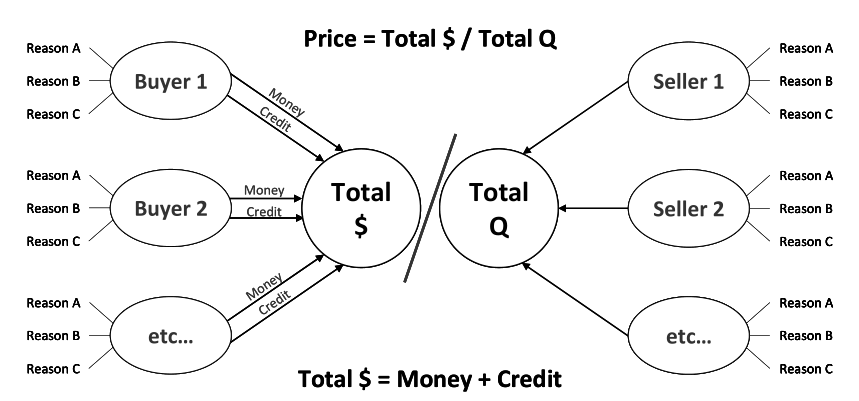

How the Economic Machine Works
==============================

1. A Transactions-Based Approach 1
----------------------------------

2. Productivity Growth 6
------------------------

3. Long-Term Debt Cycle 11
--------------------------

4. Short-Term Debt Cycle 19
---------------------------